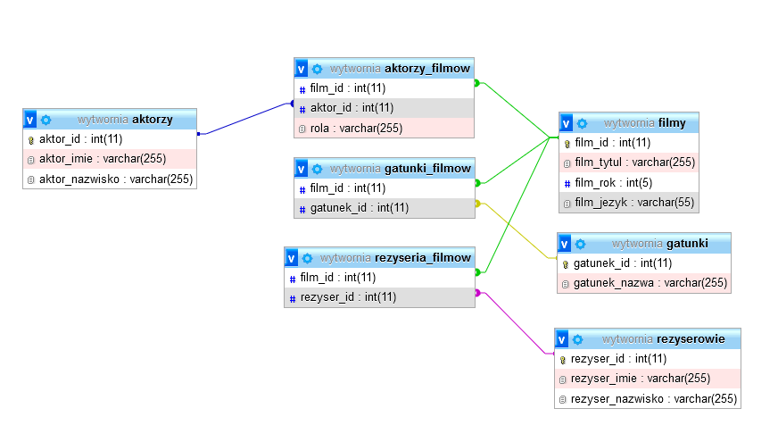
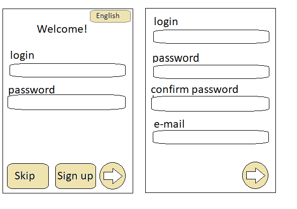
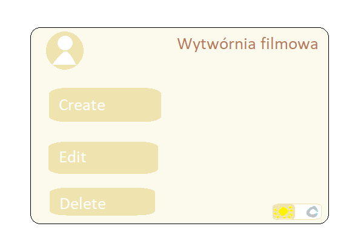

# Projekt Application

## Project Structure

```
database_queries.txt
db.sql
pom.xml
projekt.iml
select_querries.txt
.idea/
    .gitignore
    compiler.xml
    cssdialects.xml
    encodings.xml
    jarRepositories.xml
    misc.xml
    modules.xml
    uiDesigner.xml
    vcs.xml
    libraries/
        fontawesomefx_8_9.xml
        ...
lib/
    fontawesomefx-8.9.jar
    mysql-connector-java-8.0.17.jar
    protobuf-java-3.6.1.jar
pictures/
    database_after_queries.png
    ekran_logowania_startowy.png
    HomePage.png
src/
    main/
        java/
        resources/
target/
    classes/
        com/
        css/
        ...
    test-classes/
```

## Pictures

### Database After Queries


### Login Screen


### Home Page


## Description

This project is a Java-based application that allows users to browse films and actors, and see connections between them. Users can log in and browse the SQL database through the Java application. Admins have additional privileges to add new instances of these objects.

## Prerequisites

- Java Development Kit (JDK) 8 or higher
- Apache Maven
- MySQL database

## Setup

1. Clone the repository.
2. Navigate to the project directory.
3. Run `mvn clean install` to build the project.
4. Configure the database connection in `db.sql`.
5. Run the application using your preferred IDE or command line.

## Libraries

- FontAwesomeFX 8.9
- MySQL Connector Java 8.0.17
- Protobuf Java 3.6.1

## License

This project is licensed under the MIT License.